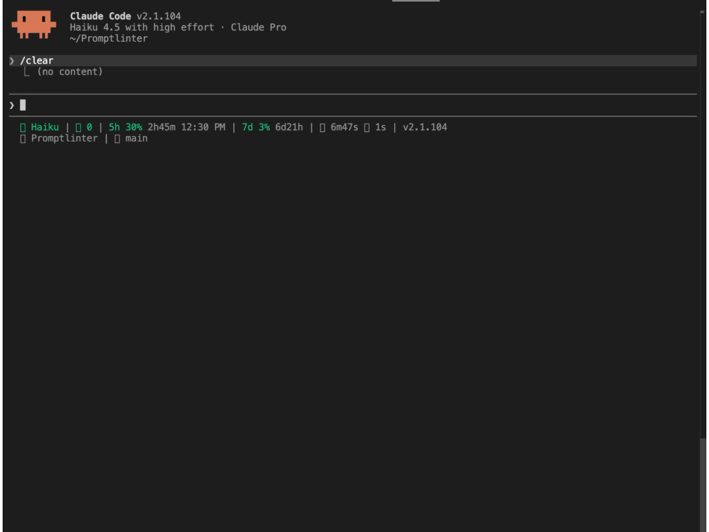

# PromptLinter

[](https://opensource.org/licenses/MIT)
[](https://goreportcard.com/report/github.com/binoyPeries/Promptlinter)
[](https://codecov.io/gh/binoyPeries/Promptlinter)

PromptLinter is a lightweight CLI hook for Claude Code that catches prompt waste before it gets sent.

It helps you write clearer prompts with fewer tokens, fewer clarification turns, and less back-and-forth.

Think of it as a small guardrail for your prompts: fast feedback before the expensive part happens.

<p align="center">
  
</p>

## Why it exists

- Dev prompts often include filler, vague references, and oversized context dumps.
- That burns tokens and adds extra turns you did not need.
- PromptLinter gives immediate feedback so you can tighten the prompt before it reaches Claude.

## What you get

- `⚡` Fast: runs on each prompt as a small Go binary.
- `🛠️` Practical: feedback is short, direct, and useful.
- `🔒` Local-first: rules engine works without external API calls.
- `🎛️` Flexible: `suggest`, `silent`, `auto`, and `off` modes.

## Install

Download the latest release for your platform from the [Releases page](https://github.com/binoyPeries/Promptlinter/releases).

Set the version you want to install (see [Releases](https://github.com/binoyPeries/Promptlinter/releases)):
```bash
VERSION=vX.Y.Z  # e.g. v0.1.0
```

**macOS (Apple Silicon):**
```bash
curl -fL "https://github.com/binoyPeries/Promptlinter/releases/download/${VERSION}/plint-darwin-arm64.tar.gz" | tar -xz && \
  sudo mkdir -p /usr/local/bin && sudo mv plint /usr/local/bin/
```

**macOS (Intel):**
```bash
curl -fL "https://github.com/binoyPeries/Promptlinter/releases/download/${VERSION}/plint-darwin-amd64.tar.gz" | tar -xz && \
  sudo mkdir -p /usr/local/bin && sudo mv plint /usr/local/bin/
```

**Linux (x86_64):**
```bash
curl -fL "https://github.com/binoyPeries/Promptlinter/releases/download/${VERSION}/plint-linux-amd64.tar.gz" | tar -xz && \
  sudo mkdir -p /usr/local/bin && sudo mv plint /usr/local/bin/
```

**Linux (arm64):**
```bash
curl -fL "https://github.com/binoyPeries/Promptlinter/releases/download/${VERSION}/plint-linux-arm64.tar.gz" | tar -xz && \
  sudo mkdir -p /usr/local/bin && sudo mv plint /usr/local/bin/
```

Verify the installation:
```bash
plint --help
```

## Connect to Claude Code

Add the following hook to your Claude Code settings file (`~/.claude/settings.json`):

```json
{
  "hooks": {
    "UserPromptSubmit": [
      {
        "matcher": "",
        "hooks": [
          {
            "type": "command",
            "command": "plint analyze"
          }
        ]
      }
    ]
  }
}
```

This tells Claude Code to run `plint analyze` on every prompt you submit. PromptLinter reads the prompt from stdin, analyzes it, and returns feedback.

## How It Works

PromptLinter uses a hybrid analysis system:

**Layer 1 — Rules Engine** (always on): Fast, local, zero-cost regex and heuristic detectors that run in ~5ms. Catches filler language, meta-commentary, oversized context dumps, vague references, and over-specification.

**Layer 2 — LLM Analysis** (opt-in): When Layer 1 detects high waste (above the escalation threshold) or structural flags, the prompt is escalated to an LLM for deeper, context-aware analysis. The LLM validates Layer 1 findings, catches issues rules miss (ambiguity, missing context), and suggests a concise rewrite. This runs through the Claude Code CLI, using your existing plan — no separate API key or setup needed.

To enable Layer 2, set `llm_enabled` to `true` in `~/.promptlinter/config.json`:

```json
{
  "llm_enabled": true,
  "llm_model": "haiku",
  "escalation_threshold": 100,
  "escalate_on_indirect_flags": true
}
```

The `llm_model` field accepts any model supported by the Claude CLI (e.g. `haiku`, `sonnet`, `opus`). Defaults to `haiku` for speed and cost.

Layer 2 is non-blocking — if the LLM call fails or times out, PromptLinter falls back to Layer 1 results.

## Modes

PromptLinter runs in `suggest` mode by default. Configure it in `~/.promptlinter/config.json`:

- `suggest` — tips shown as a Claude Code system message; prompt still goes through (default)
- `silent` — logs analysis results only, no visible output
- `auto` — blocks wasteful prompts and asks you to retype
- `off` — disables the linter entirely; all prompts pass through untouched

## What's Next

Planned features on the roadmap:

- **SQLite event logging** — persist every analysis result to a local `~/.promptlinter/events.db` database across sessions, tracking prompts, tool calls, and session summaries.
- **CLI reports** — `plint report` command with daily/weekly/monthly summaries of token waste, trends, and improvement over time. Supports text, JSON, CSV, and HTML output.
- **Multi-tool support** — adapter layer to bring prompt linting to Cursor, Aider, Cline, GitHub Copilot, Windsurf, Gemini CLI, and more. Each tool gets a thin adapter behind a common interface; a generic stdin mode works with anything.
